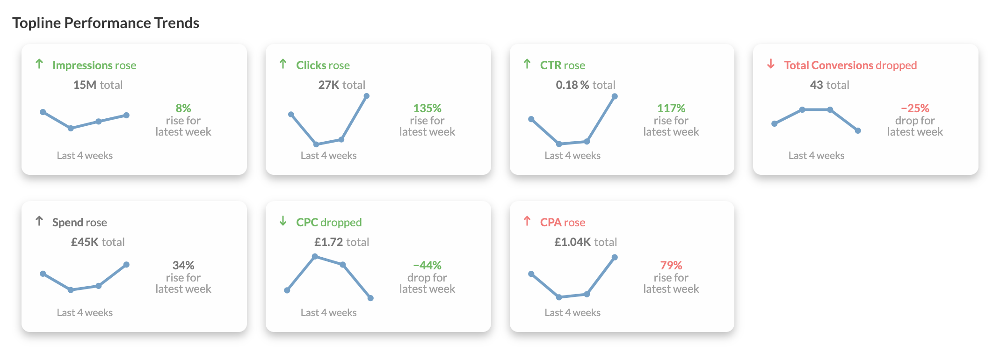

# datorama-d3-quick-trends
Custom widget for Datorama. Visualises trends for metrics broken down by a date.

This custom widget creates separate boxes for each metric added to the data query, and compares the last two data points to create a judgment ('rose', or 'dropped').



## Set up and Dependencies
Add `quickTrends.initialize();` to the JS section of the Custom Widget Editor, and add the below links to the dependencies area (second button at the top left of the Custom Widget Editor).

Script dependencies (must be loaded in this order):
1. `https://d3js.org/d3.v7.min.js`
2. `https://solutions.datorama-res.com/public_storage_solutions/quickTrends/v1/quickTrends.js`

Style dependency:
1. `https://solutions.datorama-res.com/public_storage_solutions/quickTrends/v1/quickTrends.css`

## Preferences
All preferences are located in the design tab of the widget options. These include light or dark mode, and positive/neutral/negative settings for each measurement.

## Date Range
The widget will not do any normalisation for part-filled date ranges, but it will add a warning for incomplete first or last periods. Therefore, it's recommended to use 'previous' settings wherever possible. For example, the image uses a custom date range for 'Previous 4 Weeks'. Here's how that's set up:

Start:
```
DATEADD('d', -21, env['PREV_WEEK_START'])
```
End:
```
env['PREV_WEEK_END']
```
